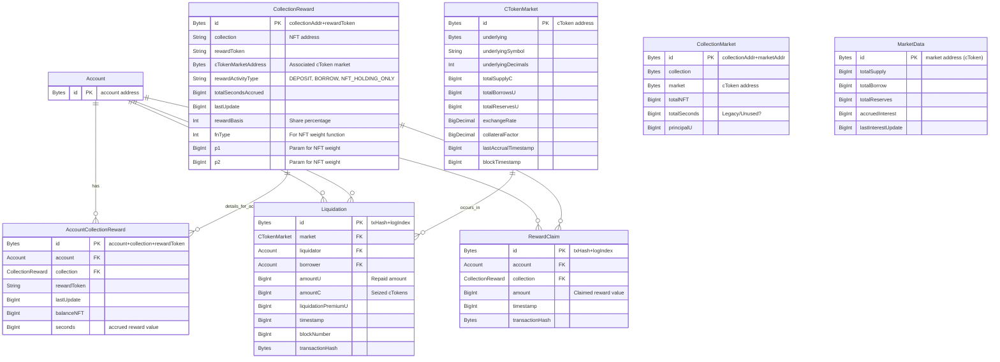

# Implementation Plan for Subgraph

This plan outlines the necessary steps to fully implement the event handlers and helper functions for your subgraph, based on `subgraph.yaml`, `schema.graphql`, and our discussion.

**Global Constants (to be defined, likely in `src/helpers.ts` or a new `config.ts`):**
*   `HARDCODED_REWARD_TOKEN_ADDRESS: Address`
*   `HARDCODED_CTOKEN_MARKET_ADDRESS: Address`

**Mermaid Diagram - Entity Relationships:**

DONE: ### I. Schema Updates ([`schema.graphql`](schema.graphql:1))

1.  **`CollectionReward` Entity (L1):**
    *   Add: `cTokenMarketAddress: Bytes! # Address of the cToken market this reward pertains to`
    *   Add: `rewardActivityType: String! # E.g., "DEPOSIT", "BORROW"`

DONE: ### II. General Setup & Review
1.  **Implement/Update Helper Functions in [`src/helpers.ts`](src/helpers.ts:1):**
    *   **`getOrCreateAccount(accountAddress: Address): Account`:** (Exists in [`src/cToken-mapping.ts`](src/cToken-mapping.ts:31), move to helpers if used more broadly or ensure it's imported).
    *   **`getOrCreateCTokenMarket(marketAddress: Address, blockTimestamp: BigInt): CTokenMarket`:** (Exists in [`src/cToken-mapping.ts`](src/cToken-mapping.ts:63), review for completeness, especially `collateralFactor`).
    *   **`getOrCreateCollectionReward(nftCollectionAddress: Address, rewardTokenAddress: Address, cTokenMarketForActivity: Address, activityType: String, initialRewardBasis: i32, initialWeightFnType: i32, eventTimestamp: BigInt): CollectionReward`:**
        *   `id = nftCollectionAddress.toHex() + "-" + rewardTokenAddress.toHex()`
        *   If new:
            *   `collection = nftCollectionAddress.toHexString()`
            *   `rewardToken = rewardTokenAddress.toHexString()`
            *   `cTokenMarketAddress = cTokenMarketForActivity`
            *   `rewardActivityType = activityType`
            *   `totalSecondsAccrued = ZERO_BI`
            *   `lastUpdate = eventTimestamp`
            *   `rewardBasis = initialRewardBasis`
            *   `fnType = initialWeightFnType` (This is for the NFT weight function, distinct from event `fnType`)
            *   `p1 = ZERO_BI` (default, updated by `WeightFunctionSet`)
            *   `p2 = ZERO_BI` (default, updated by `WeightFunctionSet`)
            *   Save and return.
    *   **`getOrCreateAccountCollectionReward(account: Account, collectionReward: CollectionReward, eventTimestamp: BigInt): AccountCollectionReward`:**
        *   `id = account.id.toHex() + "-" + collectionReward.id.toHex()` (or 3-part ID: `account.id.toHex() + "-" + collectionReward.collection + "-" + collectionReward.rewardToken`)
        *   If new:
            *   `account = account.id`
            *   `collection = collectionReward.id`
            *   `rewardToken = collectionReward.rewardToken` (string)
            *   `lastUpdate = eventTimestamp`
            *   `balanceNFT = ZERO_BI`
            *   `seconds = ZERO_BI`
            *   Save and return.
    *   **`currentDepositU(accountAddress: Bytes, cTokenMarketAddress: Bytes): BigDecimal`:**
        *   Implement logic to fetch the user's current deposit/supply in underlying units for the given `cTokenMarketAddress`. This might involve `cToken.balanceOfUnderlying(accountAddress)` or similar calls.
    *   **`currentBorrowU(accountAddress: Bytes, cTokenMarketAddress: Bytes): BigDecimal`:**
        *   Implement logic to fetch the user's current borrow balance in underlying units for the given `cTokenMarketAddress`. This might involve `cToken.borrowBalanceCurrent(accountAddress)`.
    *   **`accrueSeconds(acr: AccountCollectionReward, coll: CollectionReward, now: BigInt): void`:**
        *   `dt = now.minus(acr.lastUpdate); if (dt.isZero()) { return; }`
        *   `basePrincipalForReward = ZERO_BD;`
        *   `if (coll.rewardActivityType == "DEPOSIT") { basePrincipalForReward = currentDepositU(acr.account, coll.cTokenMarketAddress); }`
        *   `else if (coll.rewardActivityType == "BORROW") { basePrincipalForReward = currentBorrowU(acr.account, coll.cTokenMarketAddress); }`
        *   `nftHoldingWeight = weight(acr.balanceNFT.toI32(), coll); // Uses coll.fnType, p1, p2 for NFT weight`
        *   `combinedEffectiveValue = basePrincipalForReward.plus(nftHoldingWeight); // Additive combination`
        *   `rewardRateMultiplier = coll.rewardBasis.toBigDecimal().div(BigDecimal.fromString("10000")); // rewardBasis is in basis points`
        *   `finalValueWithRate = combinedEffectiveValue.times(rewardRateMultiplier);`
        *   `secDelta = finalValueWithRate.times(dt.toBigDecimal());`
        *   `acr.seconds = acr.seconds.plus(secDelta.truncate(0).toBigInt());`
        *   `coll.totalSecondsAccrued = coll.totalSecondsAccrued.plus(secDelta.truncate(0).toBigInt());`
        *   `acr.lastUpdate = now;`
        *   (Caller saves `acr` and `coll`).
    *   **`weight(n: i32, meta: CollectionReward): BigDecimal`:** (Exists, ensure it uses `meta.fnType`, `meta.p1`, `meta.p2` correctly).
    *   **`normalizeTo18Decimals(value: BigInt, decimals: i32): BigDecimal`:** (Exists).

DONE: ### III. `cToken-mapping.ts` Implementation ([`src/cToken-mapping.ts`](src/cToken-mapping.ts:1))

*   **`getOrCreateCTokenMarket` (L63):**
*   **`handleAccrueInterest(event: AccrueInterestEvent)` (L147):**
    *   Load `market = getOrCreateCTokenMarket(event.address, event.block.timestamp)`.
    *   `market.totalBorrowsU = event.params.totalBorrows`
    *   `market.totalReservesU = cToken.bind(event.address).totalReserves()`
    *   `market.exchangeRate = cToken.bind(event.address).exchangeRateStored().toBigDecimal().div(exponentToBigDecimal(18))`
    *   `market.lastAccrualTimestamp = event.block.timestamp`
    *   `market.blockTimestamp = event.block.timestamp`
    *   Save `market`.
    *   Optionally update `MarketData` entity:
        *   `md = MarketData.load(event.address)` or create new.
        *   `md.totalSupply = market.totalSupplyC` (ensure `totalSupplyC` is up-to-date)
        *   `md.totalBorrow = event.params.totalBorrows`
        *   `md.totalReserves = market.totalReservesU`
        *   `md.accruedInterest = event.params.interestAccumulated`
        *   `md.lastInterestUpdate = event.block.timestamp`
        *   Save `md`.
*   **`handleBorrow(event: BorrowEvent)` (L158):**
    *   `market = getOrCreateCTokenMarket(event.address, event.block.timestamp)`.
    *   `account = getOrCreateAccount(event.params.borrower)`.
    *   `market.totalBorrowsU = event.params.totalBorrows`
    *   `market.blockTimestamp = event.block.timestamp`
    *   Save `market`.
*   **`handleLiquidateBorrow(event: LiquidateBorrowEvent)` (L168):**
    *   `borrowMarket = getOrCreateCTokenMarket(event.address, event.block.timestamp)`.
    *   `collateralMarket = getOrCreateCTokenMarket(event.params.cTokenCollateral, event.block.timestamp)`.
    *   `liquidator = getOrCreateAccount(event.params.liquidator)`.
    *   `borrower = getOrCreateAccount(event.params.borrower)`.
    *   Create `Liquidation` entity:
        *   `id = event.transaction.hash.concatI32(event.logIndex.toI32())`
        *   `market = borrowMarket.id`
        *   `liquidator = liquidator.id`
        *   `borrower = borrower.id`
        *   `amountU = event.params.repayAmount`
        *   `amountC = event.params.seizeTokens`
        *   `liquidationPremiumU`: Calculate. (Value of `seizeTokens` in `collateralMarket.underlying` - `repayAmount` in `borrowMarket.underlying`). Requires exchange rates.
        *   `timestamp = event.block.timestamp`, `blockNumber = event.block.number`, `transactionHash = event.transaction.hash`.
        *   Save `Liquidation`.
    *   `borrowMarket.totalBorrowsU = cToken.bind(borrowMarket.id).totalBorrows()`
    *   `borrowMarket.blockTimestamp = event.block.timestamp`
    *   Save `borrowMarket`.
    *   `collateralMarket.totalSupplyC = cToken.bind(collateralMarket.id).totalSupply()` (if seizure affects it)
    *   `collateralMarket.blockTimestamp = event.block.timestamp`
    *   Save `collateralMarket`.
*   **`handleMint(event: MintEvent)` (L179):**
    *   `market = getOrCreateCTokenMarket(event.address, event.block.timestamp)`.
    *   `minter = getOrCreateAccount(event.params.minter)`.
    *   `market.totalSupplyC = cToken.bind(event.address).totalSupply()`
    *   `market.blockTimestamp = event.block.timestamp`
    *   Save `market`.
*   **`handleRedeem(event: RedeemEvent)` (L188):**
    *   `market = getOrCreateCTokenMarket(event.address, event.block.timestamp)`.
    *   `redeemer = getOrCreateAccount(event.params.redeemer)`.
    *   `market.totalSupplyC = cToken.bind(event.address).totalSupply()`
    *   `market.blockTimestamp = event.block.timestamp`
    *   Save `market`.
*   **`handleRepayBorrow(event: RepayBorrowEvent)` (L197):**
    *   `market = getOrCreateCTokenMarket(event.address, event.block.timestamp)`.
    *   `payer = getOrCreateAccount(event.params.payer)`.
    *   `borrower = getOrCreateAccount(event.params.borrower)`.
    *   `market.totalBorrowsU = event.params.totalBorrows`
    *   `market.blockTimestamp = event.block.timestamp`
    *   Save `market`.
*   **`handleTransfer(event: TransferEvent)` (cToken Transfer, L208):**
    *   `fromAccount = getOrCreateAccount(event.params.from)`.
    *   `toAccount = getOrCreateAccount(event.params.to)`.
    *   (No direct impact on `CTokenMarket` totals unless it's mint/burn, covered by other handlers).

DONE: ### IV. `collection-vault-mapping.ts` Enhancements ([`src/collection-vault-mapping.ts`](src/collection-vault-mapping.ts:1))

*   **`handleCollectionDeposit(event: CollectionDepositEvent)` (L8) / `handleCollectionWithdraw(event: CollectionWithdrawEvent)` (L49):**
    *   **NFT Count (L21, L54):** Clarify if `event.params.shares` or another param indicates NFT count. Assume `ONE_BI` for now if not.
    *   **Dynamic Asset Decimals (L26, L58):**
        *   `cTokenMarket = getOrCreateCTokenMarket(event.address, event.block.timestamp)` (event.address is the cToken market).
        *   `assetDecimals = cTokenMarket.underlyingDecimals`.
        *   Use this for `normalizeTo18Decimals`.
    *   `collectionMarketId = event.params.collectionAddress.concat(event.address)`
    *   Load or create `collectionMarket = CollectionMarket.load(collectionMarketId)`.
    *   If new: `collection = event.params.collectionAddress`, `market = event.address`, `totalNFT = ZERO_BI`, `principalU = ZERO_BD`.
    *   Update `collectionMarket.totalNFT` (+/- assumed `ONE_BI` or actual count).
    *   Update `collectionMarket.principalU` (+/- normalized `event.params.assets`).
    *   Save `collectionMarket`.

DONE: ### V. `rewards-controller-mapping.ts` Implementation ([`src/rewards-controller-mapping.ts`](src/rewards-controller-mapping.ts:1))

*   **`handleNewCollectionWhitelisted(event: NewCollectionWhitelisted)` (L18):**
    *   `nftCollectionAddress = event.params.collection`
    *   `eventFnType = event.params.fnType` (uint8 from event)
    *   `rewardShare = event.params.rewardShareBasisPoints.toI32()`
    *   `activityTypeString = ""`
    *   If `eventFnType == 0`: `activityTypeString = "DEPOSIT"`
    *   Else if `eventFnType == 1`: `activityTypeString = "BORROW"`
    *   Else: `activityTypeString = "NFT_HOLDING_ONLY"` (or log warning if undefined)
    *   `ERC721.create(nftCollectionAddress)` (Only ERC721 for now, check if already exists).
    *   `collReward = getOrCreateCollectionReward(nftCollectionAddress, HARDCODED_REWARD_TOKEN_ADDRESS, HARDCODED_CTOKEN_MARKET_ADDRESS, activityTypeString, rewardShare, 0, event.block.timestamp)`
        *   Note: The `initialWeightFnType` in `getOrCreateCollectionReward` is set to `0` (Linear) as a default. `WeightFunctionSet` will update this.
    *   Save `collReward`.
*   **`handleWhitelistCollectionRemoved(event: WhitelistCollectionRemoved)` (L22):**
    *   `collectionAddress = event.params.collection`
    *   `collectionRewardId = collectionAddress.toHex() + "-" + HARDCODED_REWARD_TOKEN_ADDRESS.toHex()`
    *   `store.remove("CollectionReward", collectionRewardId)` (Consider implications for `AccountCollectionReward`s).
*   **`handleCollectionRewardShareUpdated(event: CollectionRewardShareUpdated)` (L26):**
    *   `collectionAddress = event.params.collection`
    *   `rewardToken = event.params.rewardToken`
    *   `collectionRewardId = collectionAddress.toHex() + "-" + rewardToken.toHex()`
    *   `collReward = CollectionReward.load(collectionRewardId)`
    *   If `collReward`:
        *   // Accrue for all accounts under this collection reward before changing share
        *   // This requires iterating through derived `AccountCollectionReward` entities.
        *   // Example: `let acrs = collReward.accountRewards; for each acr in acrs { accrueSeconds(acr, collReward, event.block.timestamp); acr.save(); }`
        *   `collReward.rewardBasis = event.params.newShareBasisPoints.toI32()`
        *   `collReward.lastUpdate = event.block.timestamp`
        *   Save `collReward`.
*   **`handleWeightFunctionSet(event: WeightFunctionSet)` (L30):**
    *   `collectionAddress = event.params.collection`
    *   `rewardToken = event.params.rewardToken`
    *   `collectionRewardId = collectionAddress.toHex() + "-" + rewardToken.toHex()`
    *   `collReward = CollectionReward.load(collectionRewardId)`
    *   If `collReward`:
        *   // Accrue for all accounts before changing weight function
        *   // Similar iteration as above: `let acrs = collReward.accountRewards; for each acr in acrs { accrueSeconds(acr, collReward, event.block.timestamp); acr.save(); }`
        *   `weightFnParams = event.params.weightFn` (struct `(uint8 fnType, int256 p1, int256 p2)`)
        *   `collReward.fnType = weightFnParams.value0` (actual NFT weight fnType)
        *   `collReward.p1 = weightFnParams.value1`
        *   `collReward.p2 = weightFnParams.value2`
        *   `collReward.lastUpdate = event.block.timestamp`
        *   Save `collReward`.
*   **`handleRewardsClaimedForLazy(event: RewardsClaimedForLazy)` (L34):**
    *   `userAccount = getOrCreateAccount(event.params.user)`.
    *   `collectionAddress = event.params.collection`
    *   `rewardToken = event.params.rewardToken`
    *   `collRewardId = collectionAddress.toHex() + "-" + rewardToken.toHex()`
    *   `collReward = CollectionReward.load(collRewardId)`
    *   If `collReward`:
        *   `acr = getOrCreateAccountCollectionReward(userAccount, collReward, event.block.timestamp)`
        *   `accrueSeconds(acr, collReward, event.block.timestamp)`
        *   Create `RewardClaim`:
            *   `id = event.transaction.hash.concatI32(event.logIndex.toI32())`
            *   `account = userAccount.id`
            *   `collection = collReward.id`
            *   `amount = event.params.rewardAmount`
            *   `timestamp = event.block.timestamp`, `transactionHash = event.transaction.hash`.
            *   Save `RewardClaim`.
        *   `acr.seconds = acr.seconds.minus(event.params.secondsClaimed)` // `secondsClaimed` from event
        *   `acr.lastUpdate = event.block.timestamp`
        *   Save `acr`.
        *   Save `collReward` (as `totalSecondsAccrued` and `lastUpdate` changed).
*   **`handleBatchRewardsClaimedForLazy(event: BatchRewardsClaimedForLazy)` (L38):**
    *   Clarification still needed on how batch details are obtained. If it emits individual `RewardsClaimedForLazy` events, this handler might be minimal. Otherwise, it needs to parse batch data.

DONE: ### VI. `erc721-mapping.ts` Enhancements ([`src/erc721-mapping.ts`](src/erc721-mapping.ts:1))

*   **`handleTransfer(event: TransferEvent)` (L12):**
    *   `nftCollectionAddress = event.address`
    *   `fromUser = getOrCreateAccount(event.params.from)`.
    *   `toUser = getOrCreateAccount(event.params.to)`.
    *   // Find all CollectionReward entities for this NFT collection
    *   // This requires a way to query: e.g., if CollectionReward IDs are predictable or if we store a list.
    *   // For now, assume we can iterate or find relevant CollectionRewards.
    *   // Example: `let relevantCollRewards = ... find CollectionReward where collection == nftCollectionAddress.toHexString()`
    *   `for each activeCollReward in relevantCollRewards:`
        *   If `event.params.from` is not address zero:
            *   `acrFrom = getOrCreateAccountCollectionReward(fromUser, activeCollReward, event.block.timestamp)`
            *   `accrueSeconds(acrFrom, activeCollReward, event.block.timestamp)`
            *   `acrFrom.balanceNFT = acrFrom.balanceNFT.minus(ONE_BI)`
            *   `acrFrom.lastUpdate = event.block.timestamp`
            *   Save `acrFrom`.
        *   If `event.params.to` is not address zero:
            *   `acrTo = getOrCreateAccountCollectionReward(toUser, activeCollReward, event.block.timestamp)`
            *   `accrueSeconds(acrTo, activeCollReward, event.block.timestamp)`
            *   `acrTo.balanceNFT = acrTo.balanceNFT.plus(ONE_BI)`
            *   `acrTo.lastUpdate = event.block.timestamp`
            *   Save `acrTo`.
        *   Save `activeCollReward`.
    *   (Address `CollectionMarket.totalNFT` updates if this transfer implies staking/unstaking from a specific known market - less direct than vault events).

### VII. `erc1155-mapping.ts` Implementation ([`src/erc1155-mapping.ts`](src/erc1155-mapping.ts:1))

*   (Skipped for now as per "use only ERC721 for now").

---